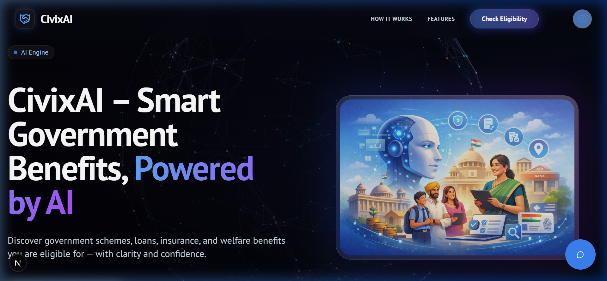

IN AI-Based Government Scheme Eligibility & Benefit Optimizer

An AI & Machine Learning powered web application that helps Indian citizens discover eligible government schemes, estimate benefits, and get priority-based recommendations using personalized data.

🚀 A real-world Applied AI + Data Science + Full-Stack project focused on social impact and e-governance.

📌 Problem Statement

India has 1000+ Central & State Government Schemes, but:

Citizens don’t know which schemes they are eligible for

Eligibility rules are complex and scattered

Benefits worth ₹2+ lakh crore remain unclaimed every year

Existing portals only provide static information

❌ No personalization
❌ No eligibility intelligence
❌ No benefit optimization

💡 Solution Overview

This project uses Machine Learning + NLP to:

Analyze user profile (age, income, state, category, occupation, etc.)

Automatically check scheme eligibility

Estimate expected benefit amount

Rank schemes based on usefulness & priority

Think of it as:

“Netflix for Government Schemes” 🎯

✨ Key Features

✅ Personalized scheme eligibility check

📊 Benefit estimation (approximate)

🧠 ML-based scheme recommendation & ranking

📄 Required documents list generation

🌍 State & category-specific rules

🤖 NLP-based scheme rule analysis (future-ready)

🧠 Machine Learning & AI Techniques Used

Classification Models

Eligible / Not Eligible prediction

Recommendation System

Priority-based scheme ranking

Natural Language Processing (NLP)

Parsing scheme rules & documents

🧾 User Input Parameters

Age

Annual Income

State & District

Education Level

Occupation (Student, Farmer, Worker, etc.)

Category (General / SC / ST / OBC)

Special Conditions (Disability, Woman, Minority, etc.)

🛠️ Tech Stack
🔹 Backend & ML

Python

Pandas, NumPy

Scikit-learn

NLP (spaCy / NLTK)

Flask / FastAPI

🔹 Frontend

React.js / HTML / CSS

Responsive UI (Mobile + Desktop)

🔹 Others

REST APIs

JSON-based scheme database

🏗️ System Architecture (High Level)
User Interface
     ↓
Backend API (Flask/FastAPI)
     ↓
ML Eligibility Engine
     ↓
Recommendation & Ranking Logic
     ↓
Scheme Database

📤 Output

📋 List of eligible government schemes

💰 Estimated benefit amount

⭐ Priority-ranked recommendations

📑 Required documents checklist

🎯 Use Cases

Citizens (Urban & Rural)

NGOs & Social Organizations

Government Help Centers

E-Governance Platforms

Civic-tech Startups

🌱 Future Enhancements

🔗 Aadhaar & DigiLocker integration

💬 Multilingual AI chatbot (Hindi + Regional languages)

📱 Mobile App / PWA support

🗂️ Real-time application tracking

# CivixAI – Smart Government Benefits, Powered by AI 🚀



## Overview 🌟

**CivixAI** is a comprehensive, AI-driven platform designed to help citizens seamlessly discover and verify their eligibility for government schemes, loans, insurance, and welfare benefits.

Finding the right government assistance usually involves vast amounts of paperwork, navigating highly confusing criteria, and spending hours trying to figure out if you're even eligible. **CivixAI solves this by combining a beautifully immersive front-end Next.js application with a high-performance Machine Learning microservice.**

## ✨ Key Features

- **🚀 Highly Personalized Eligibility Engine**: Tell us a few things about your profile (Age, State, Caste, Income, Occupation, etc.) and our Python ML microservice will compute exactly which schemes you are most likely eligible for. 
- **📈 ML-Driven Confidence Scoring**: We use trained `CatBoost` and `XGBoost` ranker models to analyze historical and synthesized demographic data, calculating a precise **Plausibility/Confidence Score** for your scheme approval.
- **💬 Smart Conversational Chatbot**: Need quick answers or help navigating? Our integrated Gemini-powered chatbot answers scheme-related queries and seamlessly redirects you to the Eligibility portals directly from the chat box!
- **⚡ Dynamic Scheme Generation**: If a scheme lacks detailed explanations in the official CSV, our internal logic dynamically engineers highly readable, informative summaries based on the scheme's Ministry, Level, and Category so you are never left guessing.
- **👍 Continuous Feedback Loop**: Improve the machine learning results! Our built-in Feedback mechanics (Thumbs Up/Thumbs Down) continuously capture your interactions to naturally train the inference models.
- **📱 Responsive & Beautiful UI**: A world-class interface leveraging Framer Motion animations, complex Tailwind properties, customizable UI components, and Glassmorphism design elements.

## 🛠️ Tech Stack

**Frontend (Client & UI)**
- `Next.js 14` (App Router)
- `React 18`
- `Tailwind CSS`
- `Framer Motion` (Advanced animations)
- `Lucide React` (Icons)
- `@google/genkit` (Gemini integration for the Chatbot)

**Backend / Machine Learning Microservice**
- `FastAPI` (High performance Python API)
- `CatBoost` (State of the art Gradient Boosting for ranking features)
- `XGBoost` (Secondary Baseline models)
- `Scikit-learn` & `Pandas` (Data pre-processing, calibration, synthetic pipelines)
- `Uvicorn` (ASGI Python Server)

## 📦 Getting Started

### 1. Requirements

Before starting, ensure you have installed:
- [Node.js](https://nodejs.org/) (v18 or higher)
- [Python](https://www.python.org/downloads/) (3.10 or higher)

### 2. Configure Environment Variables

Create a `.env` file in the root of the project from the provided `.env.example` template and configure your API keys (e.g., your `GEMINI_API_KEY`).

### 3. Start the Backend ML Server

The AI logic runs on a dedicated FastAPI server.
```bash
# Navigate to your project folder
cd CivixAI

# It is highly recommended to use a virtual environment
python -m venv venv
# On Windows
venv\Scripts\activate      
# On Mac/Linux
source venv/bin/activate 

# Install the Python dependencies (Assumes requirement files are setup)
pip install -r requirements.txt 

# Start the actual FastAPI Service on port 8000/8001
python -m uvicorn services.ml_api.main:app --port 8000 --reload
```

### 4. Start the Frontend Application

In a new terminal tab (while your Python server is running):
```bash
# Install NPM dependencies
npm install

# Start the Next.js development server
npm run dev
```

Open [http://localhost:3000](http://localhost:3000) with your browser to experience CivixAI.

## 🧠 Under The Hood: The ML Engine

CivixAI relies on a complex pipeline to provide real-time matching. The dataset (master schemes list) is continually evaluated against the `UserProfile` schema:
1. **Rule-Based Pre-Filtering**: Deterministic checks like minimum age gaps, geographical state restrictions (e.g., UP vs MP), and family income caps.
2. **Feature Engineering**: Features like `per_capita_income` and `age_income_ratio` are engineered live on inference requests.
3. **Probability Scoring `CatBoost`**: The ML models execute and generate a blended probability that combines strict rules with contextual logic, outputting detailed `.pkl` model weights.

## 🤝 Contributing

We welcome contributions! Feel free to open an Issue or submit a Pull Request if you'd like to help optimize the models or enrich the UI.

## 👨‍💻 Author

**Akshit**
*Applied AI / Data Science + Full-Stack Developer*
*Interested in AI for Social Impact & Scalable Products*
